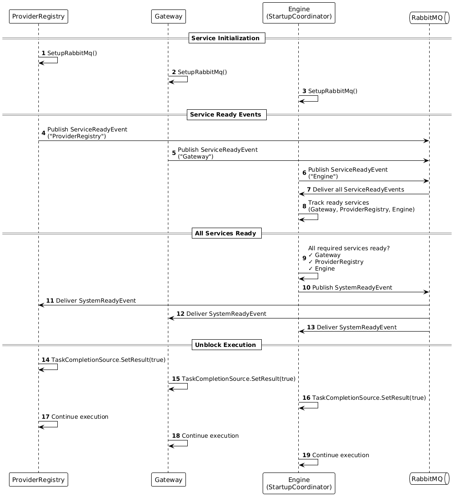
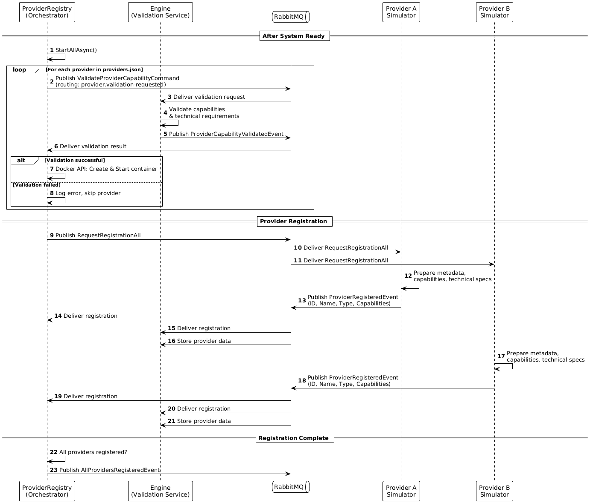
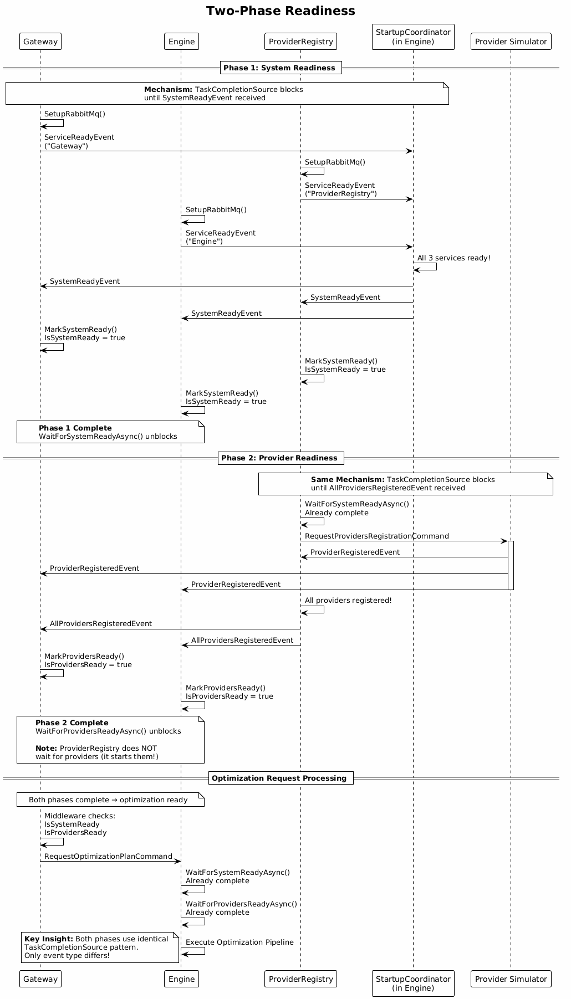

# System Startup Synchronization (System Readiness)

_(User Story: [US-20](project-overview.md#epic-5-platform-features--extensibility) — Platform extensibility, [US-26](project-overview.md#epic-7-infrastructure--deployment) — Containerization)_

When the system starts, microservices coordinate their initialization using a **two-phase readiness model** based on `TaskCompletionSource`.

## Implementation

### Architecture Overview

**Common.Messaging (base layer):**
- [ISystemReadinessService](../ManufacturingOptimization.Common.Messaging/Abstractions/ISystemReadinessService.cs) — interface with wait/check methods for both phases
- [SystemReadinessService](../ManufacturingOptimization.Common.Messaging/SystemReadinessService.cs) — base implementation with `TaskCompletionSource` for each phase
- Events: `ServiceReadyEvent`, `SystemReadyEvent`, `AllProvidersRegisteredEvent`

**Engine (extended layer):**
- [StartupCoordinator](../ManufacturingOptimization.Engine/Services/StartupCoordinator.cs) — extends `SystemReadinessService`, adds coordination logic

**Gateway:**
- [SystemReadinessMiddleware](../ManufacturingOptimization.Gateway/Middleware/SystemReadinessMiddleware.cs) — HTTP protection with two-phase checks

### ISystemReadinessService

Interface defines operations for both phases:
- `WaitForSystemReadyAsync()` / `WaitForProvidersReadyAsync()` — blocking wait
- `IsSystemReady` / `IsProvidersReady` — non-blocking check

### SystemReadinessService

Base implementation in `Common.Messaging`:
- Two `TaskCompletionSource` instances (one per phase)
- Subscribes to `SystemReadyEvent` and `AllProvidersRegisteredEvent`
- Marks phase ready when event received
- Used directly in Gateway and ProviderRegistry

### StartupCoordinator

Extends `SystemReadinessService` in Engine with coordination logic:
- Tracks `ServiceReadyEvent` from Gateway, Engine, ProviderRegistry
- When all 3 ready → publishes `SystemReadyEvent`
- Inherits Phase 2 tracking from base class

### SystemReadinessMiddleware

[SystemReadinessMiddleware](../ManufacturingOptimization.Gateway/Middleware/SystemReadinessMiddleware.cs) — protects HTTP endpoints. `IsSystemReady`, `IsProvidersReady` for all requests  

```csharp
if (!readinessService.IsSystemReady)
    return HTTP 503;
if (!readinessService.IsProvidersReady)
    return HTTP 503;
```

## The Unified Mechanism

Both phases use **identical synchronization pattern**:

1. **TaskCompletionSource** — blocks execution until specific event received
2. **Event subscription** — service listens for readiness event
3. **Mark ready** — event triggers `TaskCompletionSource.SetResult(true)`
4. **Unblock** — waiting code continues execution

The only difference between phases: **which event** triggers unblocking.

## Phase 1: System Readiness

**Goal:** Ensure core services (Gateway, Engine, ProviderRegistry) are initialized.

**How it works:**
- Each service publishes `ServiceReadyEvent` after setup
- `StartupCoordinator` collects events from all 3 services
- When all ready, publishes `SystemReadyEvent`
- Services unblock via `WaitForSystemReadyAsync()`

**Code example:**
```csharp
// ProviderRegistry startup
await _readinessService.WaitForSystemReadyAsync();
await _orchestrator.StartAllAsync();  // Can start providers now
```



## Phase 2: Provider Readiness

**Goal:** Ensure all providers are registered before processing optimization requests.

**How it works:**
- ProviderRegistry requests provider registration after Phase 1
- Each provider publishes `ProviderRegisteredEvent`
- When all registered, ProviderRegistry publishes `AllProvidersRegisteredEvent`
- Services unblock via `WaitForProvidersReadyAsync()`

**Code example:**
```csharp
// Engine optimization handler
await _readinessService.WaitForSystemReadyAsync();    // Phase 1
await _readinessService.WaitForProvidersReadyAsync(); // Phase 2
// Start optimization
```

> **Note:** Phase 2 uses the **exact same mechanism** as Phase 1 — different event type, same pattern.

### Provider Registration and Startup Process

After Phase 1 completes, ProviderRegistry orchestrates provider startup: in **development mode** ([ComposeManagedOrchestrator](../ManufacturingOptimization.ProviderRegistry/Services/ComposeManagedOrchestrator.cs)) containers are already running via docker-compose and immediately receive registration request; in **production mode** ([DockerProviderOrchestrator](../ManufacturingOptimization.ProviderRegistry/Services/DockerProviderOrchestrator.cs)) each provider is validated through Engine's [ProviderCapabilityValidationService](../ManufacturingOptimization.Engine/Services/ProviderCapabilityValidationService.cs) before Docker container creation, then registration is requested from all started providers.



## Differential Dependencies

Different components wait for different phases:

| Component | Phase 1 | Phase 2 | Reason |
|-----------|---------|---------|--------|
| **ProviderRegistry** | yes | no | Cannot wait for providers — it starts them |
| **Gateway** | yes | yes | Blocks optimization requests until providers ready |
| **Engine** | yes | yes | Needs complete provider pool for optimization |

## The Whole Mechanism

