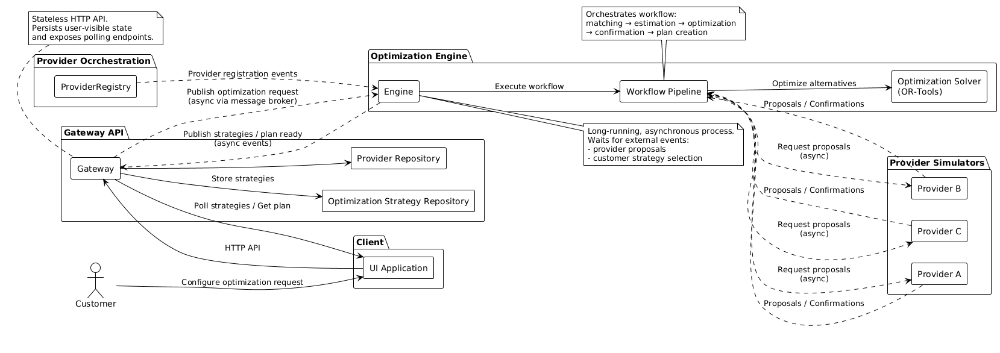
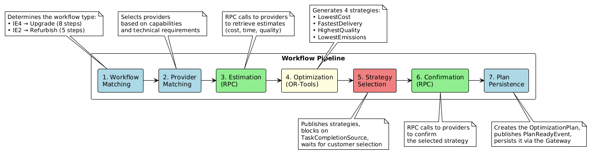
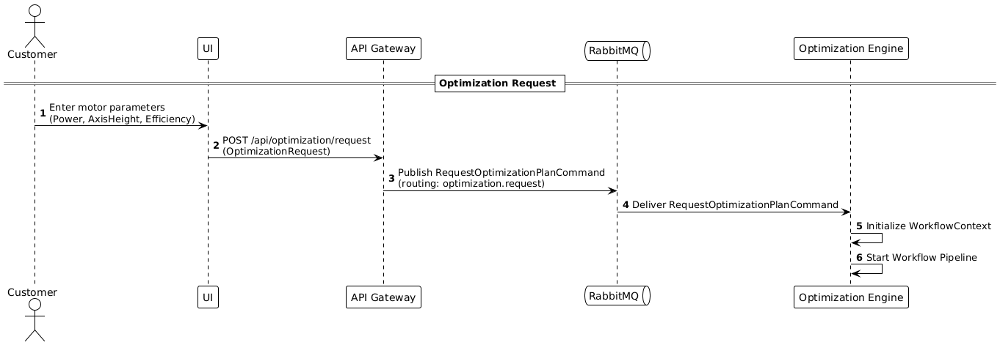
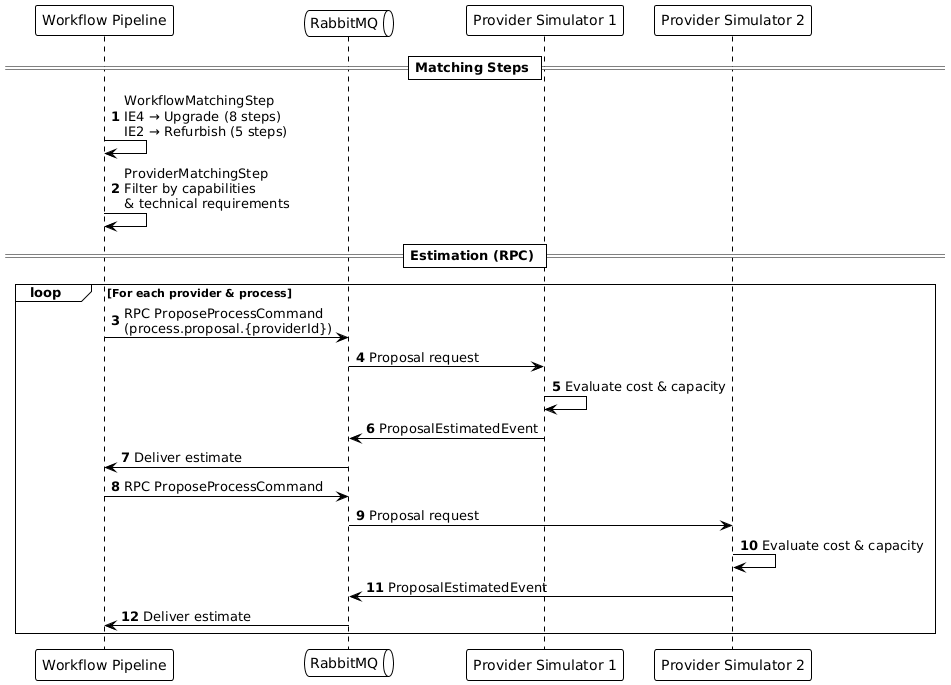
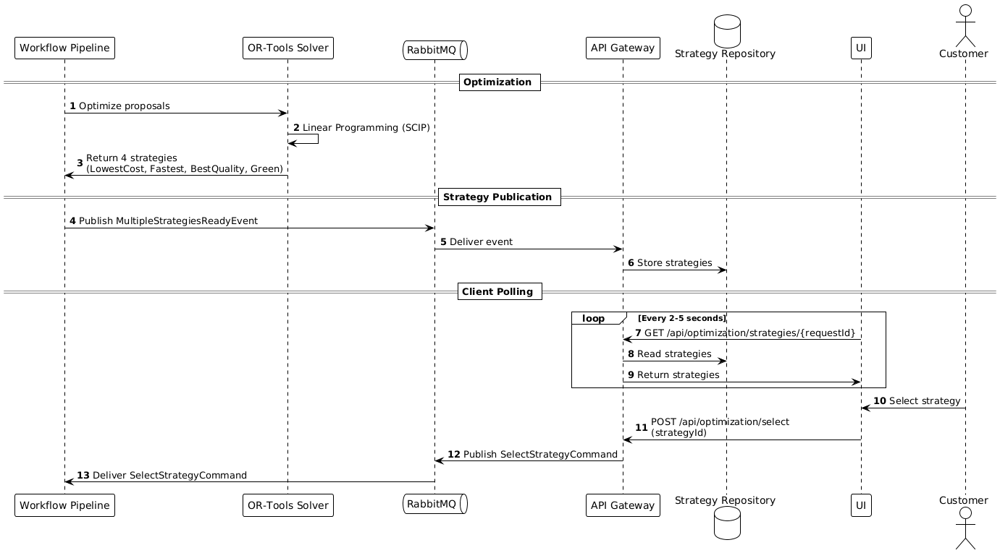
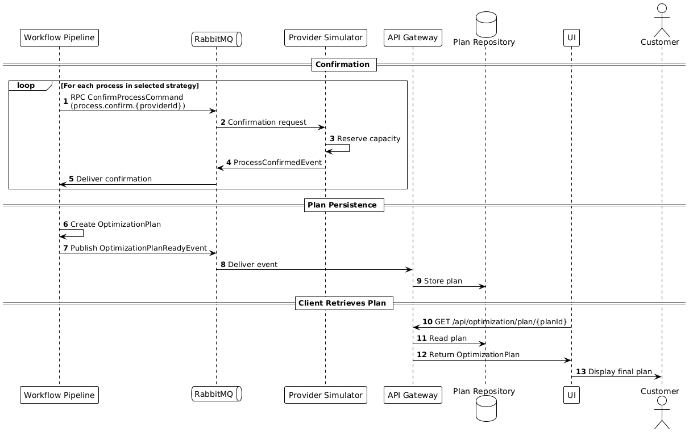

# Manufacturing Optimization Process (Optimization Pipeline)

_(User Stories: [US-06](project-overview.md#epic-2-customer-request-management) — Customer requests, [US-07](project-overview.md#epic-2-customer-request-management) — Strategy recommendations, [US-12](project-overview.md#epic-3-optimization--matchmaking) — Workflow matching, [US-13](project-overview.md#epic-3-optimization--matchmaking) — Optimization)_

Optimization Pipeline is the main mechanism for processing customer requests for manufacturing process optimization. The system analyzes requirements, selects providers, generates optimization strategies, and awaits customer selection.

## System Architecture Diagram



**Key Components:**

1. **UI** — client application for submitting requests and selecting strategies
2. **Gateway** — REST API with strategy and plan storage, polling support
3. **Engine** — optimization service with Workflow Pipeline and OR-Tools solver
4. **Provider Simulators** — manufacturing providers (can be simulators or real systems)
5. **Provider Registry** — provider registration service, publishes events about new capabilities
6. **Message Broker (RabbitMQ)** — asynchronous communication between services (implicitly shown via dashed lines)

## Pipeline Pattern

### WorkflowContext

[WorkflowContext](../ManufacturingOptimization.Engine/Models/WorkflowContext.cs) — context object that flows through all pipeline steps.

**Critical Note:** WorkflowContext is the **key interaction point of the entire system**. Most data used during the optimization process flows through it. WorkflowContext contains the majority of shared models from the [ManufacturingOptimization.Common.Models](../ManufacturingOptimization.Common.Models/) project.

**Models Used in WorkflowContext:**
- [OptimizationRequest](../ManufacturingOptimization.Common.Models/OptimizationRequest.cs)
- [OptimizationRequestConstraints](../ManufacturingOptimization.Common.Models/OptimizationRequestConstraints.cs)
- [MotorSpecifications](../ManufacturingOptimization.Common.Models/MotorSpecifications.cs)
- [MotorEfficiencyClass](../ManufacturingOptimization.Common.Models/MotorEfficiencyClass.cs)
- [OptimizationProcessStep](../ManufacturingOptimization.Common.Models/OptimizationProcessStep.cs)
- [ProcessType](../ManufacturingOptimization.Common.Models/ProcessType.cs)
- [ProcessEstimate](../ManufacturingOptimization.Common.Models/ProcessEstimate.cs)
- [Provider](../ManufacturingOptimization.Common.Models/Provider.cs)
- [ProviderProcessCapability](../ManufacturingOptimization.Common.Models/ProviderProcessCapability.cs)
- [ProviderTechnicalCapabilities](../ManufacturingOptimization.Common.Models/ProviderTechnicalCapabilities.cs)
- [OptimizationStrategy](../ManufacturingOptimization.Common.Models/OptimizationStrategy.cs)
- [OptimizationPriority](../ManufacturingOptimization.Common.Models/OptimizationPriority.cs)
- [OptimizationMetrics](../ManufacturingOptimization.Common.Models/OptimizationMetrics.cs)
- [OptimizationPlan](../ManufacturingOptimization.Common.Models/OptimizationPlan.cs)
- [OptimizationPlanStatus](../ManufacturingOptimization.Common.Models/OptimizationPlanStatus.cs)

### IWorkflowStep

[IWorkflowStep](../ManufacturingOptimization.Engine/Abstractions/IWorkflowStep.cs) — interface for a pipeline step.

```csharp
public interface IWorkflowStep
{
    string Name { get; }
    Task ExecuteAsync(WorkflowContext context, CancellationToken cancellationToken = default);
}
```

Each step:
- Reads data from `WorkflowContext`
- Executes its logic (calculations, sending messages, awaiting responses)
- Writes results back to `WorkflowContext`

### WorkflowPipeline

[WorkflowPipeline](../ManufacturingOptimization.Engine/Services/Pipeline/WorkflowPipeline.cs) — pipeline executor, sequentially invokes steps.

```csharp
public async Task ExecuteAsync(WorkflowContext context, CancellationToken cancellationToken = default)
{
    foreach (var step in _steps)
    {
        await step.ExecuteAsync(context, cancellationToken);
    }
}
```

### PipelineFactory

[PipelineFactory](../ManufacturingOptimization.Engine/Services/Pipeline/PipelineFactory.cs) — factory for creating pipeline with specified steps.

## Optimization Pipeline Steps

### Pipeline Steps Overview



### 1. Workflow Matching Step

[WorkflowMatchingStep](../ManufacturingOptimization.Engine/Services/Pipeline/WorkflowMatchingStep.cs) — determines workflow type _(User Story: [US-12](project-overview.md#epic-3-optimization--matchmaking) — Workflow matching)_.

**Logic:**
- Compares `CurrentEfficiency` and `TargetEfficiency` from the request
- If `TargetEfficiency > CurrentEfficiency` → **Upgrade** (8 steps)
- Otherwise → **Refurbish** (5 steps)

**Upgrade Steps:**
1. Cleaning
2. Disassembly
3. Redesign
4. Turning
5. Grinding
6. Part Substitution
7. Reassembly
8. Certification

**Refurbish Steps:**
1. Cleaning
2. Disassembly
3. Part Substitution
4. Reassembly
5. Certification

**Result:** fills `context.WorkflowType` and `context.ProcessSteps`

### 2. Provider Matching Step

[ProviderMatchingStep](../ManufacturingOptimization.Engine/Services/Pipeline/ProviderMatchingStep.cs) — selects providers for each step.

**Logic:**
- For each `ProcessStep`, finds providers with required capability from repository
- Filters by technical requirements:
  - `Power` ≥ required motor power
  - `AxisHeight` ≥ required axis height
- Saves `MatchedProviders` list for each step

**Data source:** providers previously registered via `ProviderRegisteredEvent` and stored in repository

**Result:** fills `processStep.MatchedProviders` for each step

### 3. Estimation Step

[EstimationStep](../ManufacturingOptimization.Engine/Services/Pipeline/EstimationStep.cs) — obtains preliminary estimates from providers _(User Stories: [US-05](project-overview.md#epic-1-technology-provider-management) — Provider proposals, [US-15](project-overview.md#epic-4-process-coordination--workflow) — Provider receive proposals)_.

**Logic:**
- For each provider in `MatchedProviders`, sends `ProposeProcessToProviderCommand` via RPC
- Routing key: `process.proposal.{providerId}`
- Awaits `ProcessProposalEstimatedEvent` response (10-second timeout)
- Provider can:
  - **Accept** — return `IsAccepted = true` with estimate (`Estimate`)
  - **Decline** — return `IsAccepted = false` with reason (`DeclineReason`)

**Providers:** [ProviderSimulator](../ManufacturingOptimization.ProviderSimulator/ProviderSimulatorWorker.cs) processes proposals and returns estimates

**Result:** fills `provider.Estimate` for each provider

### 4. Optimization Step

[OptimizationStep](../ManufacturingOptimization.Engine/Services/Pipeline/OptimizationStep.cs) — generates optimization strategies via Google OR-Tools _(User Story: [US-13](project-overview.md#epic-3-optimization--matchmaking) — Step assignment optimization)_.

**Logic:**
- Generates 4 strategies with different priorities:
  - `LowestCost` — lowest cost
  - `FastestDelivery` — shortest time
  - `HighestQuality` — highest quality
  - `LowestEmissions` — lowest CO₂ emissions
- Solves linear programming problem for each strategy
- Assigns optimal provider for each process step

**Technology:** Google OR-Tools Linear Solver

**Result:** fills `context.Strategies` with strategy list

**Detailed description:** see [Optimization Step — Strategy Generation with Google OR-Tools](05-optimization-step.md)

### 5. Strategy Selection Step

[StrategySelectionStep](../ManufacturingOptimization.Engine/Services/Pipeline/StrategySelectionStep.cs) — awaits customer strategy selection _(User Story: [US-07](project-overview.md#epic-2-customer-request-management) — Strategy recommendations)_.

**Logic:**

1. **Strategy publication:**
   - Sends `MultipleStrategiesReadyEvent` to system
   - Gateway receives event and saves strategies in repository

2. **Temporary queue creation:**
   - Creates queue `engine.strategy.selection.{requestId}`
   - Binds to routing key `optimization.strategy.selected.{requestId}`

3. **Blocking via TaskCompletionSource:**
   - Pipeline stops and waits for customer selection
   - Timeout: 10 minutes

4. **Polling from client side:**
   - UI periodically polls `GET /api/optimization/strategies/{requestId}`
   - Gateway returns saved strategies
   - Client displays strategies and awaits user selection

5. **Strategy selection:**
   - Client sends `POST /api/optimization/select` with selected strategy
   - Gateway publishes `SelectStrategyCommand` with routing key for specific request
   - Engine receives command, `TaskCompletionSource` completes, pipeline continues

**Timeout:** if client doesn't respond within 10 minutes, exception is thrown, pipeline terminates

**Result:** fills `context.SelectedStrategy` and `context.PlanId`

### 6. Confirmation Step

[ConfirmationStep](../ManufacturingOptimization.Engine/Services/Pipeline/ConfirmationStep.cs) — confirmation from providers.

**Logic:**
- For each process in selected strategy, sends `ConfirmProcessProposalCommand` via RPC
- Routing key: `process.confirm.{providerId}`
- Includes `PlanId` for plan identification
- Awaits `ProcessProposalConfirmedEvent` response (10-second timeout)
- Providers confirm participation in manufacturing

**Result:** all providers confirmed readiness to execute processes

### 7. Plan Persistence Step

[PlanPersistenceStep](../ManufacturingOptimization.Engine/Services/Pipeline/PlanPersistenceStep.cs) — plan persistence and notification.

**Logic:**
- Creates `OptimizationPlan` with selected strategy
- Saves plan to repository
- Publishes `OptimizationPlanReadyEvent` event
- Gateway receives event and saves plan locally

**Result:**
- Plan available via `GET /api/optimization/plan/{planId}`
- UI can display final plan to customer

## Sequence Diagrams: Optimization Process

### 1. Optimization Request



Customer enters motor parameters via UI, Gateway publishes command to RabbitMQ, Engine initializes Workflow Pipeline.

### 2. Matching and Estimation



Pipeline determines workflow type (Upgrade/Refurbish), selects providers, and requests estimates via RPC pattern.

### 3. Optimization and Strategy Selection



OR-Tools generates 4 strategies, Gateway saves them, UI polls Gateway (polling), customer selects strategy.

### 4. Confirmation and Plan Delivery



Pipeline requests confirmations from providers, creates final plan, Gateway saves plan, customer receives result.

---